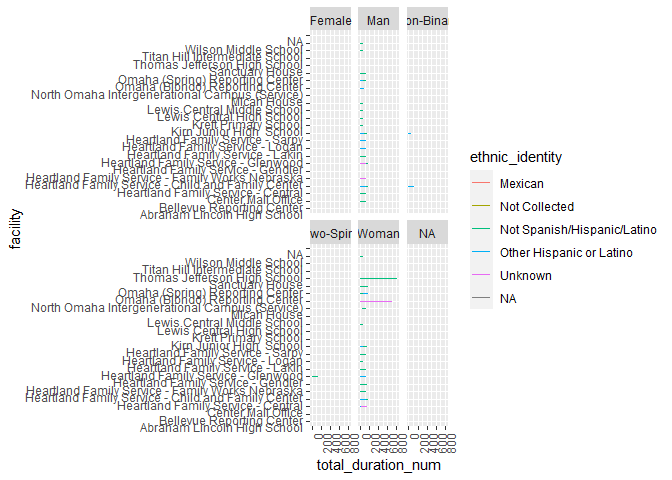
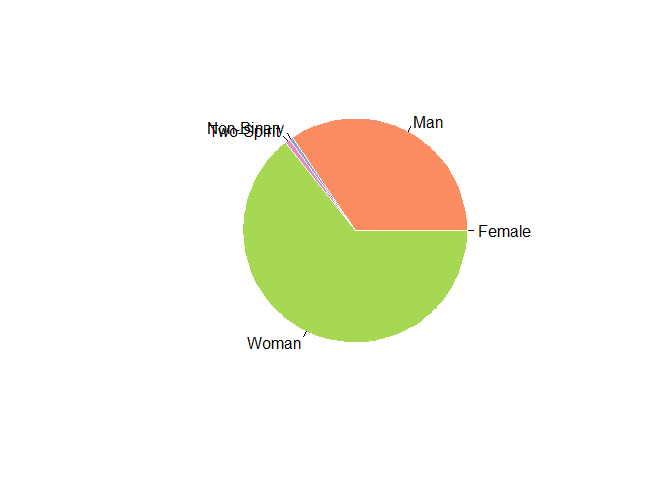
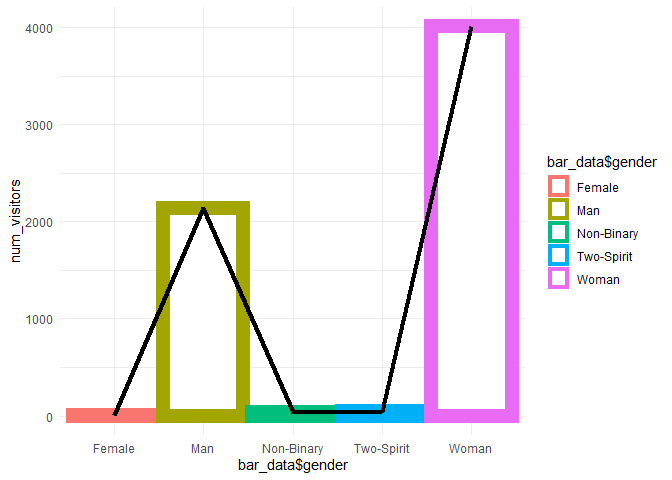

Worst Plots Contest
================

## Worst Plots Contest

In this task i would like to show some Worst Plots with HFS data

``` r
library('ggplot2')
df<-read.csv('HFS Service Data.csv')
```

### Worst Plot 1

``` r
library('ggplot2')
new_df<-df
new_df <- new_df [(!(new_df$gender_identity=="Other") & !(new_df$gender_identity=="Client Declined to Give")&!(new_df$gender_identity=="Not Obtained")),]
ggplot(data = new_df) + 
  geom_line(mapping = aes(y = facility, x= total_duration_num,color=ethnic_identity)) + 
  theme(axis.text.y = element_text(angle=0, vjust=1, hjust=1),axis.text.x = element_text(angle=90, vjust=1, hjust=1))+
  facet_wrap(~gender_identity)
```

    ## Warning: Removed 499 row(s) containing missing values (geom_path).

<!-- -->

#### Reason: 

* Even though we show all data in the plot we can
understand that this plot is worst because of the missing data of
`female` and also there are some other entries like
`Other`,`Client Declined to Give` and `Not Obtained` which should be
removed because that may lead viewers into false assumptions.

*   The plot is so clumsy and and there are so many `NA` values in both
    X and Y axises.

* In this plot there are some issues in scaling which might not increate the intrest of viewers.
  

###Worst Plot 2

``` r
library(RColorBrewer)
myPalette <- brewer.pal(5, "Set2")
#s<-table(new_df,new_df$program_name,new_df$gender_identity)
pie_data<-setNames(
aggregate(
new_df$program_name~new_df$gender_identity,
data=new_df,length),c("gender","num_visitors"))
pie_data$percentage<-(pie_data$num_visitors*100)/sum(pie_data$num_visitors)
pie(pie_data$num_visitors,labels =pie_data$gender, border="white", col=myPalette )
```

<!-- -->

####Reason: \* The above **Pie-chat** is not a good fit for the data
because of the overlapping labels and not specifying the data.

-   Plot may be a bit confusing because there are some values were even
    if it have data in it it shows like 0 or 1 in the graph.lets take
    **female, Non-Binary and Two-Spirit** as an example where it’s value
    is 2 ,36,43 but when we see the graph we can see that all the 3 are
    almost same.

-   If we further investigate we can notice that there are `two` values
    that tells about same thing in the pie chat like **Female & Women**.
    Which may confuse the views.

###Worst Plot 3

``` r
library(RColorBrewer)
myPalette <- brewer.pal(5, "Set2")
bar_data<-setNames(
aggregate(
new_df$program_name~new_df$gender_identity,
data=new_df,length),c("gender","num_visitors"))
bar_data$percentage<-(bar_data$num_visitors*100)/sum(bar_data$num_visitors)
ggplot(bar_data) + 
  geom_col(aes(x =bar_data$gender, y = num_visitors,color=bar_data$gender), size = 5, fill = "white") +theme_minimal() +
  geom_line(aes(x =bar_data$gender, y = num_visitors), size = 1.5, group = 1)
```

    ## Warning: Use of `bar_data$gender` is discouraged. Use `gender` instead.

    ## Warning: Use of `bar_data$gender` is discouraged. Use `gender` instead.

    ## Warning: Use of `bar_data$gender` is discouraged. Use `gender` instead.

<!-- -->

####Reason: In this above bar plot I can tell that it is worst plot
because of few reason:

-   **Reason:1** There is no mistake in plotting both line and bar plot
    in a single graph.But, we need to take some things under
    consideration.

    -   what we can observe?
    -   what is the use of it? But in the above graph we can see that
        there is no use of line plot on a bar plot.

-   **Reason:2** We can observe that there are multiple colors in the
    graph which is not that usefull because they are already labelled
    with names.

-   **Reason:3** the count of Female,Non-Binary,Two-Spirit is 2, 36 and
    43 but in the plot all the values are very close. If we reduce the
    scale of y axis then we can tell that
